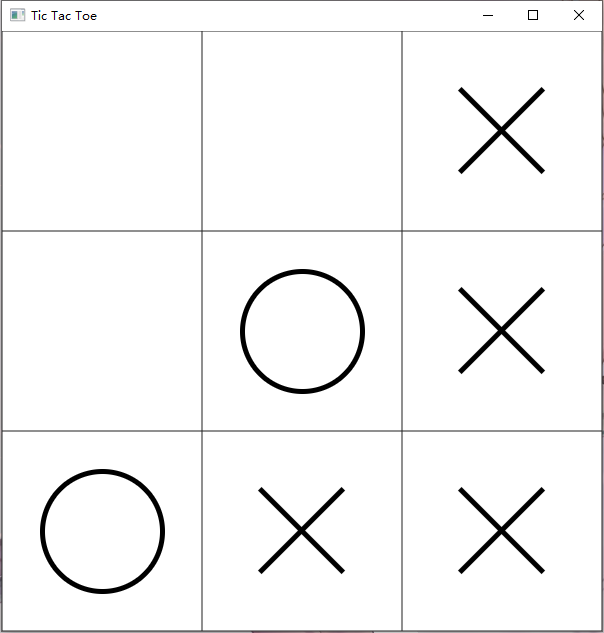

# Lab 10
JavaFX 井字棋

# 井字棋
井字棋（Tic-tac-toe）是种纸笔游戏。游戏中有两个玩家，一个打圈(O)，一个打叉(X)，轮流在3乘3的格上打自己的符号，最先以横、直、斜连成一线则为胜。

# 实现要求

在这个Lab中，我们设计一个简易井字棋界面并实现简单的交互逻辑，界面示例如下图所示：

## 创建井字棋界面

仿照示例图，利用JavaFX创建简单的井字棋界面。

> 提示：界面上的“O”和“X”棋子大家可以使用贴图来实现，也可以使用JavaFX的Shape类来实现（如Circle，Line等），使用JavaFX Shape类的同学可以获得Lab附加分

## 实现交互逻辑
一开始棋盘为空白，随着用户点击空白方格，用户点击过的方格**交替**出现“O”和“X”。

## 终局判断
若出现某种符号以横、直、斜连成一线则游戏终止，给出提示

# Deadline
2018 年 12 月 23 日 23:59（一共两周时间）

请将Lab代码上传到FTP上

# 拓展阅读
*(此部分不是必看，推荐对界面设计有兴趣的同学阅读)*

对PJ2美观性有进一步需求的同学，推荐阅读这个简单易懂的教程，内含完整且比较详细的JavaFX界面美化过程：
[https://github.com/SongshuA/iGoBang](https://github.com/SongshuA/iGoBang)
